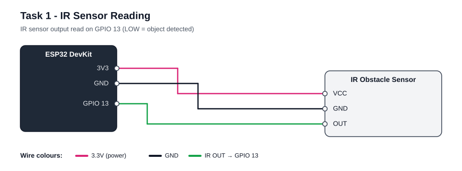
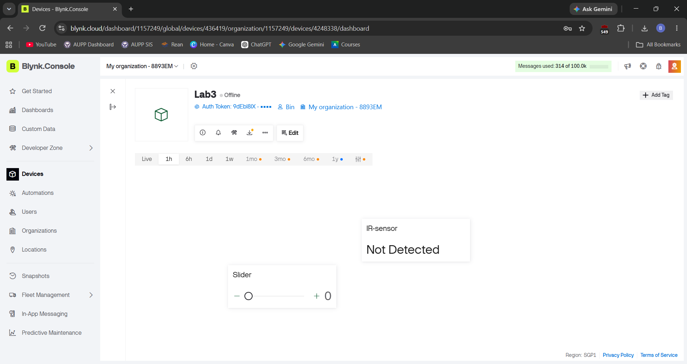
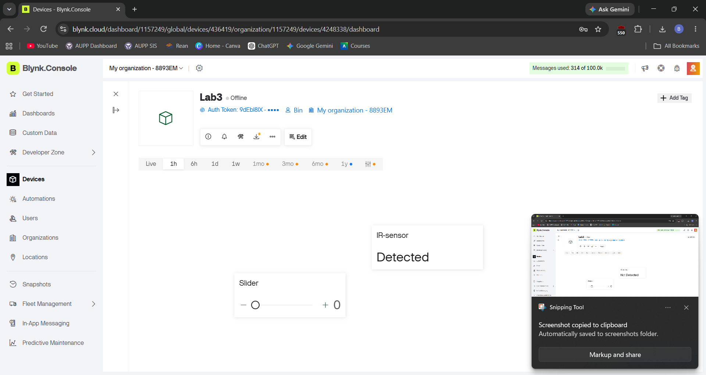
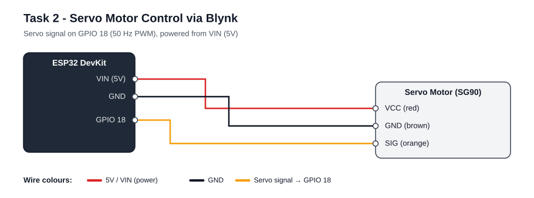
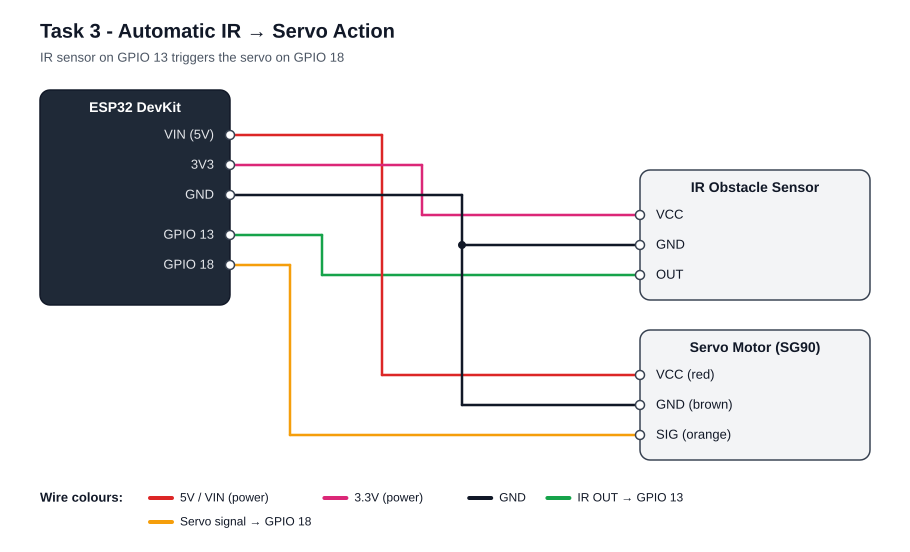
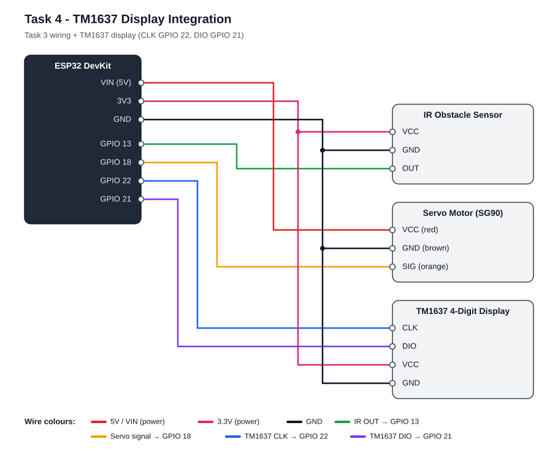

# IoT Group 3 — Lab 3: IR Sensor, Servo and TM1637 with Blynk

## Overview

This lab connects an ESP32 running MicroPython to the **Blynk IoT** cloud and builds a small automatic gate in five steps. An IR obstacle sensor detects objects, a servo motor acts as the gate, a TM1637 4-digit display counts detections, and a Blynk dashboard on the phone shows the status and gives manual control.

The board talks to Blynk through Blynk's **HTTP REST API** (`http://blynk.cloud/external/api`) using `urequests`, the same approach as our earlier Blynk practice. There is no Blynk library to install. The board writes a value with `/update?token=...&V0=...` and reads one with `/get?token=...&V1`.

What we went through:

1. **Task 1** — read the IR sensor and pushed "Detected / Not Detected" to Blynk.
2. **Task 2** — drove the servo from a Blynk slider (0–180°) using 50 Hz PWM.
3. **Task 3** — made the servo open by itself when the IR sensor sees an object, then close after 3 seconds.
4. **Task 4** — counted detections and showed the count on both the TM1637 and Blynk. MicroPython has no built-in TM1637 support, so we added a driver file, [`TM1637.py`](TM1637.py), that has to be saved onto the ESP32.
5. **Task 5** — added a Blynk switch for a manual override mode, in which the IR sensor is ignored and the slider moves the servo.

Problems we ran into and fixed along the way:

- **Wi-Fi would not connect.** The ESP32 only supports **2.4 GHz** Wi-Fi and cannot see 5 GHz networks. We switched to the router's 2.4 GHz network. We also rewrote the connection code so it retries, clears a half-finished connection from the previous run, and prints the reason when it fails.
- **Finding the Blynk datastreams.** The easiest way to create them turned out to be from inside each widget's settings (**+ Create Datastream**), not from the Datastreams tab.
- **Counter stuck at 1 on Blynk.** Blynk caps a value at the datastream's Max, so the counter datastream needs a large Max (we use 1,000,000).

| Task | What it adds | Blynk pins |
|:--|:--|:--|
| [Task 1](#task-1--ir-sensor-reading) | IR status on Blynk | V0 |
| [Task 2](#task-2--servo-motor-control-via-blynk) | Servo controlled by a Blynk slider | V1 |
| [Task 3](#task-3--automatic-ir--servo-action) | IR sensor opens and closes the servo automatically | V0 |
| [Task 4](#task-4--tm1637-display-integration) | Detection counter on the TM1637 and on Blynk | V0, V2 |
| [Task 5](#task-5--manual-override-mode) | Blynk switch to turn automatic mode off | V0, V1, V2, V3 |

The Blynk widgets are named after the task that first needs them, but they are shared. Later tasks reuse the earlier widgets: Tasks 3 and 4 show their status on the Task 1 widget, and Task 5 uses all four.

---

## Hardware and files

**Hardware:** ESP32 DevKit (MicroPython firmware), IR obstacle sensor module, SG90 servo motor, TM1637 4-digit 7-segment display, jumper wires and a USB cable.

| File | Purpose |
|:--|:--|
| [`Lab3_task1.py`](Lab3_task1.py) | Task 1 — IR sensor reading |
| [`Lab3_task2.py`](Lab3_task2.py) | Task 2 — servo control via Blynk slider |
| [`Lab3_task3.py`](Lab3_task3.py) | Task 3 — automatic IR → servo |
| [`Lab3_task4.py`](Lab3_task4.py) | Task 4 — counter on TM1637 and Blynk |
| [`main.py`](main.py) | Task 5 — manual override mode (the complete program, using every part of the lab) |
| [`TM1637.py`](TM1637.py) | TM1637 display driver (helper file, needed by Tasks 4 and 5) |
| [`docs/`](docs/) | Wiring diagrams for every task |
| [`Evidence/`](Evidence/) | Screenshots and photos (videos are linked on YouTube) |

### Pin summary

| Component | Component pin | ESP32 pin |
|:--|:--|:--|
| IR sensor | VCC / GND / OUT | 3V3 / GND / **GPIO 13** |
| Servo (SG90) | Red / Brown / Orange | VIN (5V) / GND / **GPIO 18** |
| TM1637 | VCC / GND / CLK / DIO | 3V3 / GND / **GPIO 22** / **GPIO 21** |

All grounds must be connected together. The servo is powered from VIN (5V) because 3.3V is too weak to move it reliably. The IR sensor is powered from 3.3V so its output never goes above the 3.3V an ESP32 pin can safely take.

### Wiring photo

<!-- EVIDENCE: replace the line below with your file, e.g.  -->
> **[ Place evidence here: photo of the complete wiring ]**

---

## Wi-Fi and Blynk setup

### 1. Wi-Fi

Every task file starts with a config block. Fill in your own values before running:

```python
WIFI_SSID = ""   # your Wi-Fi name (must be a 2.4 GHz network)
WIFI_PASS = ""   # your Wi-Fi password

BLYNK_TOKEN = ""  # your Blynk device auth token
```

When the board connects, the Thonny shell prints `WiFi connected!` and the ESP32's IP address. If it cannot connect within 20 seconds, it prints the reason and tries again:

| Message | Meaning |
|:--|:--|
| `WiFi not found...` | Wrong network name, or it is a 5 GHz network |
| `Wrong WiFi password.` | Password is wrong |
| `WiFi connection failed (status ...)` | Anything else, such as a weak signal. It keeps retrying |

### 2. Blynk template and device

1. Sign in at [blynk.cloud](https://blynk.cloud) and install the **Blynk IoT** app on your phone.
2. Go to **Developer Zone → My Templates → New Template**. Choose hardware **ESP32** and connection **WiFi**.
3. Go to **Devices → New Device → From template** and pick the template.
4. Copy the device's **Auth Token** into `BLYNK_TOKEN`. Use the same token in every task file so all widgets update on one dashboard.

### 3. Datastreams (virtual pin mapping)

A datastream is a numbered slot (V0, V1, …) that both the ESP32 and the dashboard can read and write. The easiest way to create one is from a widget: add the widget to the dashboard, open its ⚙️ settings, and click **+ Create Datastream → Virtual Pin**. You only need to set the fields below and can leave the rest at their defaults.

| Pin | Name | Data type | Min | Max | Written by | Used in |
|:--|:--|:--|:--|:--|:--|:--|
| **V0** | IR Status | **String** | – | – | ESP32 | Tasks 1, 3, 4, 5 |
| **V1** | Servo Angle | Integer | 0 | 180 | Phone | Tasks 2, 5 |
| **V2** | IR Counter | Integer | 0 | **1,000,000** | ESP32 | Tasks 4, 5 |
| **V3** | Manual Mode | Integer | 0 | 1 | Phone | Task 5 |

V0 must be **String**, otherwise the words "Detected" and "Not Detected" cannot be shown. V2 needs a large Max (we use **1,000,000**), because Blynk caps values at Max.

The pin numbers are set near the top of `Lab3_task4.py` and `main.py`, so a different mapping only needs a change in one place:

```python
V_IR_STATUS = "V0"
V_SLIDER    = "V1"
V_COUNT     = "V2"
V_MANUAL    = "V3"
```

### 4. Dashboard widgets

The dashboard has one widget per virtual pin. Each widget is named after the task that introduced it, but it is **not limited to that task**. Every task that uses a pin shares its widget.

| Widget title | Widget type | Datastream | Used by |
|:--|:--|:--|:--|
| Task 1 - IR Status | Label | V0 | Tasks 1, 3, 4, 5 |
| Task 2 - Servo Control | Slider (0–180°) | V1 | Tasks 2, 5 |
| Task 4 - Detection count | Gauge (0 – 1,000,000) | V2 | Tasks 4, 5 |
| Task 5 - Manual Override | Switch | V3 | Task 5 |

Task 3 has no widget of its own. Its status appears on the Task 1 - IR Status widget. In the phone app, the Label is called **Value Display**, and the Switch is a **Button** with Mode set to **Switch**.

- **Web dashboard:** open the template → **Edit → Web Dashboard**, drag the widget in, click ⚙️, pick the datastream, then **Save**.
- **Phone app:** open the device, tap 🔧, tap **+**, add the widget, tap it to pick the datastream, then tap ✕ to exit edit mode.

---

## Using each Blynk control

| Control | What to do | What happens |
|:--|:--|:--|
| **Task 1 - IR Status** (V0) | Nothing — display only | Shows `Detected`, `Not Detected`, or `Manual Mode` (Task 5) |
| **Task 2 - Servo Control** (V1) | Drag from 0 to 180 | The servo turns to that angle within about a second. In Task 5 it only works while the switch is ON |
| **Task 4 - Detection count** (V2) | Nothing — display only | The gauge goes up by 1 for every object the IR sensor sees. It always matches the TM1637 |
| **Task 5 - Manual Override** (V3) | Toggle ON / OFF | **ON** = manual mode: IR is ignored and the slider moves the servo. **OFF** = automatic mode: the IR sensor opens the gate and counts |

The board checks Blynk every 0.2 seconds, so a change on the phone reaches the servo after a short delay of roughly 0.5–1 second, depending on the network.

---

## Running a task

1. Save [`TM1637.py`](TM1637.py) onto the ESP32. You only need to do this once, and only Tasks 4 and 5 use it. In Thonny, open the file, then choose **File → Save as → MicroPython device** and name it exactly `TM1637.py`. Alternatively, open **View → Files**, right-click the file and choose **Upload to /**. To check, type `import TM1637` in the shell. No error means it worked.
2. Open the task file in Thonny, fill in the Wi-Fi name, password and token, and press **Run**.
3. Press **Stop** before running a different task.

If `main.py` is saved onto the ESP32 itself, MicroPython runs it automatically every time the board powers on, so the finished project works without a laptop.

---

## Task 1 — IR Sensor Reading

**Goal:** read the IR sensor's digital output with the ESP32 and show "Detected / Not Detected" on Blynk.

### Wiring



| IR sensor | ESP32 |
|:--|:--|
| VCC | 3V3 |
| GND | GND |
| OUT | GPIO 13 |

### Instructions

1. Wire the IR sensor as shown above.
2. In Blynk, add the **Task 1 - IR Status** Label widget linked to **V0** (String).
3. Run [`Lab3_task1.py`](Lab3_task1.py).
4. Hold your hand about 5 cm in front of the sensor. The label changes to **Detected**. Remove your hand and it changes back to **Not Detected**.
5. If it never triggers, turn the small screw (potentiometer) on the sensor to adjust how far it can see.

### How it works

The IR module's output is **active LOW**: it reads `0` when an object is in front and `1` when the path is clear. The loop reads the pin every 0.2 seconds. It only sends a value to Blynk **when the status changes**, which avoids sending hundreds of identical requests:

```python
detected = ir.value() == 0
status = "Detected" if detected else "Not Detected"

if status != last_status:
    blynk_write("V0", status)
    last_status = status
```

Spaces in the text are sent as `%20`, because a raw space is not allowed in a URL.

### Evidence

The Blynk label switches between the two states as an object is placed in front of the sensor and removed.

| No object in front of the sensor | Object in front of the sensor |
|:--:|:--:|
|  |  |
| `Not Detected` | `Detected` |

---

## Task 2 — Servo Motor Control via Blynk

**Goal:** a Blynk slider from 0 to 180° moves the servo, and the servo follows the slider.

### Wiring



| Servo wire | ESP32 |
|:--|:--|
| Red (VCC) | VIN (5V) |
| Brown (GND) | GND |
| Orange (signal) | GPIO 18 |

### Instructions

1. Wire the servo as shown above.
2. In Blynk, add the **Task 2 - Servo Control** Slider widget linked to **V1** (Integer, Min 0, Max 180).
3. Run [`Lab3_task2.py`](Lab3_task2.py).
4. Drag the slider. The servo turns to the same angle, and the Thonny shell prints `Servo angle: ...`.

### How it works

A hobby servo expects a pulse every 20 ms (50 Hz). The **width** of that pulse sets the angle: about 0.5 ms for 0° and about 2.5 ms for 180°. `set_servo_angle()` converts an angle into a pulse width, then into the 16-bit duty value that `PWM.duty_u16()` takes:

```python
pulse_us = 500 + (angle * 2000) // 180      # 0° → 500 µs, 180° → 2500 µs
servo.duty_u16(pulse_us * 65535 // 20000)   # fraction of the 20 ms period
```

The main loop reads V1 from Blynk every 0.2 seconds and only moves the servo when the value has changed.

### Evidence

<!-- EVIDENCE: replace PASTE_YOUTUBE_LINK_HERE with the YouTube link -->
▶️ **[Watch Task 2 on YouTube](https://youtu.be/ZI0r7tcOmb4)** — the phone slider moving the servo

---

## Task 3 — Automatic IR → Servo Action

**Goal:** when the IR sensor detects an object, the servo opens by itself, and after a short delay it returns to the closed position.

### Wiring



Tasks 1 and 2 combined: IR OUT → GPIO 13 and servo signal → GPIO 18. Both GNDs go to the ESP32 GND.

### Instructions

1. Wire the IR sensor and the servo as shown above.
2. No new widget is needed. The status appears on the **Task 1 - IR Status** widget (V0).
3. Run [`Lab3_task3.py`](Lab3_task3.py).
4. Put an object in front of the sensor. The servo swings to **90° (open)**, stays open for **3 seconds**, then returns to **0° (closed)**.
5. The servo will not open again until the object has been removed and a new object is detected.

### How it works

```python
if ir.value() == 0:
    set_servo_angle(OPEN_ANGLE)     # 90°
    time.sleep(OPEN_TIME)           # 3 s
    set_servo_angle(CLOSED_ANGLE)   # 0°

    while ir.value() == 0:          # wait for the object to leave
        time.sleep(0.1)
```

The last `while` loop makes sure one object causes one opening. Without it, an object left in front of the sensor would make the gate open and close over and over. The open angle, closed angle and delay are settings at the top of the file (`OPEN_ANGLE`, `CLOSED_ANGLE`, `OPEN_TIME`).

### Evidence

<!-- EVIDENCE: replace PASTE_YOUTUBE_LINK_HERE with the YouTube link -->
▶️ **[Watch Task 3 on YouTube](https://youtu.be/qDkIhC7w5W8)** — the servo opening automatically when an object is detected

---

## Task 4 — TM1637 Display Integration

**Goal:** count the IR detection events, show the count on the TM1637 display, and send the same value to a Blynk numeric display.

### Wiring



Task 3 wiring, plus the display:

| TM1637 | ESP32 |
|:--|:--|
| CLK | GPIO 22 |
| DIO | GPIO 21 |
| VCC | 3V3 |
| GND | GND |

### Instructions

1. Save [`TM1637.py`](TM1637.py) onto the ESP32 (see [Running a task](#running-a-task)).
2. Wire the TM1637 as shown above.
3. In Blynk, add the **Task 4 - Detection count** Gauge widget linked to **V2** (Integer, Min 0, Max 1,000,000). The **Task 1 - IR Status** widget keeps showing Detected / Not Detected.
4. Run [`Lab3_task4.py`](Lab3_task4.py). The display shows `----` while Wi-Fi connects, then `0`.
5. Each time an object passes the sensor, the gate opens and closes, and the count goes up by 1 on **both** the TM1637 and Blynk.

### About the TM1637 driver

The TM1637 uses a simple two-wire protocol. The driver switches CLK and DIO on and off to send commands, so it works on any GPIO pins. The task code only uses these calls:

| Call | Effect |
|:--|:--|
| `tm = TM1637.TM1637(clk=Pin(22), dio=Pin(21))` | Set up the display |
| `tm.brightness(7)` | Brightness from 0 (dim) to 7 (bright) |
| `tm.number(42)` | Show a number, right-aligned, up to 9999 |
| `tm.show("----")` | Show text (digits, `-`, and some letters) |

### How it works

```python
count += 1
tm.number(count % 10000)     # TM1637 has only 4 digits
blynk_write(V_COUNT, count)  # same value to Blynk V2
```

Both outputs are updated from the same variable at the same moment, so the display and the phone always agree. The TM1637 only has 4 digits, so above 9999 it starts again from 0, while Blynk keeps the full number. The count only goes up once per object, for the same reason explained in Task 3.

### Evidence

<!-- EVIDENCE: replace PASTE_YOUTUBE_LINK_HERE with the YouTube link -->
▶️ **[Watch Task 4 on YouTube](PASTE_YOUTUBE_LINK_HERE)** — the TM1637 and the Blynk gauge showing the same count

---

## Task 5 — Manual Override Mode

**Goal:** a Blynk switch turns automatic IR mode on or off. While manual mode is active, the IR sensor is ignored.

### Wiring


Same wiring as Task 4. The override switch exists only on the Blynk dashboard.

### Instructions

1. Keep the Task 4 wiring and make sure `TM1637.py` is on the board.
2. In Blynk, add the **Task 5 - Manual Override** Switch widget linked to **V3** (Integer, 0–1). Task 5 also uses the other three widgets: IR Status (V0), Servo Control (V1) and Detection count (V2).
3. Run [`main.py`](main.py).
4. **Switch OFF (automatic mode):** behaves exactly like Task 4. The IR sensor opens the gate and the count goes up.
5. **Switch ON (manual mode):** the status shows `Manual Mode`. Putting an object in front of the sensor does **nothing**, the servo does not move and the count stays the same. Dragging the **slider** moves the servo instead.
6. Switch back to OFF. The servo returns to closed and automatic mode resumes.

### How it works

Each time through the loop, the board reads V3 first and decides which mode to run:

```python
manual_mode = blynk_read_int(V_MANUAL, 0) == 1

if manual_mode:
    angle = blynk_read_int(V_SLIDER, current_angle)   # IR ignored, slider in control
    ...
elif ir.value() == 0:
    ...                                               # Task 4 behaviour
```

In manual mode the code never reads `ir.value()`, which is what "the IR sensor is ignored" means in practice. When the switch goes back to OFF, the servo is sent back to closed so automatic mode always starts from a known position.

### Evidence

<!-- EVIDENCE: replace PASTE_YOUTUBE_LINK_HERE with the YouTube link -->
▶️ **[Watch Task 5 on YouTube](PASTE_YOUTUBE_LINK_HERE)** — switching between manual and automatic mode

---

## Blynk dashboard

<!-- EVIDENCE: replace the line below with your file, e.g.  -->
> **[ Place evidence here: screenshot of the completed Blynk web dashboard ]**

<!-- EVIDENCE: replace the line below with your file, e.g.  -->
> **[ Place evidence here: screenshot of the completed Blynk phone dashboard ]**

## Demonstration video

<!-- EVIDENCE: replace PASTE_YOUTUBE_LINK_HERE with the YouTube link -->
▶️ **[Watch the full demonstration on YouTube](PASTE_YOUTUBE_LINK_HERE)** — the complete system running from `main.py`

---

## Troubleshooting

| Problem | Fix |
|:--|:--|
| Stuck at `Connecting to WiFi` | Use a **2.4 GHz** network. The ESP32 cannot use 5 GHz |
| `OSError: Wifi Internal State Error` | Press Stop and run again. The new connection code already clears the old connection |
| `ImportError: no module named 'TM1637'` | `TM1637.py` is not on the ESP32, or the name's capitalisation differs |
| TM1637 stays blank | Check whether CLK and DIO are swapped, and check VCC/GND |
| Blynk shows nothing | The token is wrong, or the widget is linked to a different datastream |
| "Detected" does not appear | V0 must be a **String** datastream |
| Blynk count stuck at one number | Raise V2's **Max** (ours is 1,000,000) |
| Servo jitters or resets the board | Power the servo from VIN (5V), not 3V3, and use a good USB cable |
